# wolfBoot Cmake

From the [docs for CMake Presets](https://cmake.org/cmake/help/latest/manual/cmake-presets.7.html):

"_Added in version 3.19.

One problem that CMake users often face is sharing settings with other people for common ways to configure
a project. This may be done to support CI builds, or for users who frequently use the same build. CMake
supports two main files, `CMakePresets.json` and `CMakeUserPresets.json`, that allow users to specify common
configure options and share them with others. CMake also supports files included with the include field.

`CMakePresets.json` and` CMakeUserPresets.json` live in the project's root directory. They both have
exactly the same format, and both are optional (though at least one must be present if `--preset` is
specified). `CMakePresets.json` is meant to specify project-wide build details, while `CMakeUserPresets.json`
is meant for developers to specify their own local build details.

CMakePresets.json may be checked into a version control system, and `CMakeUserPresets.json` should NOT be
checked in. For example, if a project is using Git, `CMakePresets.json` may be tracked, and
`CMakeUserPresets.json` should be added to the .gitignore."

## CMake Logic Flow

```mermaid
flowchart TD
  %% wolfBoot CMake Build Logic Flow (GitHub-safe)

  %% === Local Dev ===
  A1["Start in VS 2022 / VS Code"] --> A2["Select CMake preset: windows-stm32l4 or linux-stm32l4"]
  A2 --> A3{"Target preset?"}
  A3 --> A4["Ensure toolchains on PATH: ARM_GCC_BIN, Ninja"]
  A4 --> A5["Run: cmake --preset &lt;name&gt;"]
  A5 --> A6["Optional: cmake --build --preset &lt;name&gt;"]

  %% === Configure ===
  A5 --> C1["Load CMakePresets.json"]
  C1 --> C2["Resolve env vars: PATH, ARM_GCC_BIN, VISUALGDB"]
  C2 --> C3["Apply cache vars: WOLFBOOT_TARGET, BOARD, addresses"]
  C3 --> C4["Load toolchain file: toolchain_arm-none-eabi.cmake"]
  C4 --> C5["Generate build system: Ninja"]

  %% === Preset-specific branches ===
  C5 --> B0(("Begin preset specifics"))
  subgraph PS["Preset specifics"]
    direction TB

    %% Windows column
    subgraph BWIN["Windows: windows-stm32l4"]
      direction TB
      BW1["Generator: Ninja (VS 2022 or standalone)"]
      BW2["Quote paths with spaces (e.g., Program Files)"]
      BW3["Set ARM_GCC_BIN to Windows install path"]
      BW4["Use VisualGDB include/BSP paths"]
      BW5["Artifacts: .bin, .hex; optional .dfu"]
      BW6["Flash: ST-Link CLI or STM32CubeProgrammer"]
      BW1 --> BW2 --> BW3 --> BW4 --> BW5 --> BW6
    end

    %% Linux column
    subgraph BLNX["Linux: linux-stm32l4"]
      direction TB
      BL1["Generator: Ninja (system package)"]
      BL2["ARM_GCC_BIN in /opt or /usr/bin"]
      BL3["dfu-util or stlink from package manager"]
      BL4["CI-friendly paths: avoid spaces"]
      BL5["Artifacts: .bin, .hex, .dfu"]
      BL6["Flash: st-flash or dfu-util"]
      BL1 --> BL2 --> BL3 --> BL4 --> BL5 --> BL6
    end
  end

  B0 --> BW1
  B0 --> BL1
  BW6 --> BZ(("Merge"))
  BL6 --> BZ

  %% === Build, Sign, Package ===
  BZ --> D1["Build host tools: sign, keytools"]
  D1 --> D2["Compile wolfBoot core and HAL"]
  D2 --> D3["Link bootloader and test apps"]
  D3 --> D4["Create image header"]
  D4 --> D5["Sign firmware image: ECC256, SHA256"]
  D5 --> D6["Package artifacts: bin, hex, dfu"]

  %% === Deploy & CI ===
  D6 --> E1["Option A: Flash to device (stlink, dfu-util)"]
  E1 --> E2["Run smoke tests and UART debug"]
  E2 --> E3["Option B: Upload artifacts in GitHub Actions"]
  E3 --> E4["CI: set up toolchains and CMake on runners"]
  E4 --> E5["CI: matrix build per target preset"]
  E5 --> E6["CI: archive results and report status"]

  %% === Errors (dotted refs) ===
  A5 -.-> X1["Preset not found or Ninja missing"]
  C2 -.-> X2["Toolchain not found: fix ARM_GCC_BIN/PATH, verify VisualGDB"]
  C3 -.-> X3["Address/partition mismatch: verify BOARD, flash offsets, IMAGE_HEADER_SIZE"]
```

